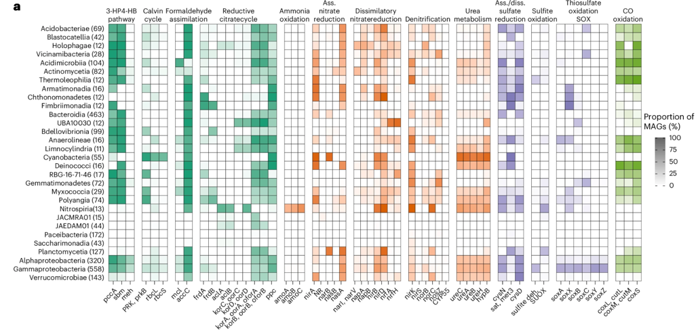
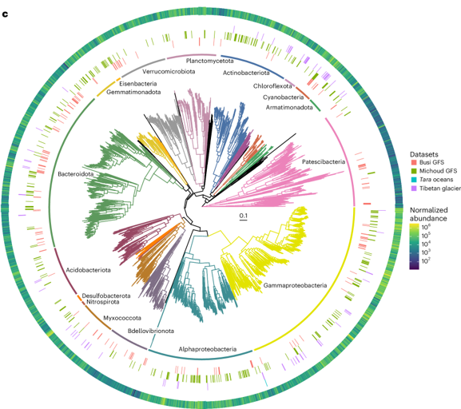

# R语言科研可视化作品集

这是一个收集和复现高水平科学论文图表的代码库。每个项目都包含可复现的代码、数据和详细注释，旨在打造一个高质量的科学图表“食谱”。

---

## ✨ 作品画廊 (Gallery)

| ID  | 预览图 (Preview) | 描述与核心技术 | 项目链接 |
|:---:|:---|:---|:---:|
| **01** |  | **组合式热图**   • **来源**: *Nature Microbiol.*   • **DOI**: [10.1038/s41564-024-01874-9](https://doi.org/10.1038/s41564-024-01874-9)   • **核心技术**: `ggplot2`, `patchwork` | [➡️ 查看项目](./Projects/01_20251114组合热图/) |
| **02** |  | **多层注释进化树**   • **来源**: *Nature Microbiol.*   • **DOI**: [10.1038/s41564-024-01874-9](https://doi.org/10.1038/s41564-024-01874-9)   • **核心技术**: `ggtree`, `ggtreeExtra`, `ggnewscale` | [➡️ 查看项目](./Projects/02_20251116NM进化树/) |
| ... | ... | ... | ... |

---

### 如何使用

1.  **克隆仓库**: `git clone https://github.com/petemeng/Awesome-Scientific-Charts.git`
2.  **浏览项目**: 每个项目文件夹 (如 `Projects/01_...`) 都是一个独立的单元。
3.  **运行代码**: 打开项目内的 `.R` 文件，根据代码注释安装所需包，即可复现结果。

### 联系我

如果您对项目有任何疑问或建议，欢迎通过 [邮箱](570696628@qq.com) 或 [wechat](PeterMeng9) 与我联系。
